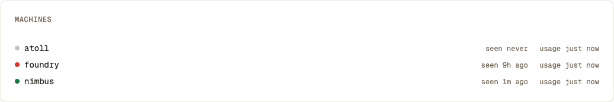

# TokenTab

[](https://www.repostatus.org/#active)
[](CONTRIBUTING.md)


**[Live demo →](https://tokentab.42labs.io/)** — 100% synthetic data, no store behind it.

> *What AI actually costs — across providers, projects and machines, with the
> flat-rate plans included rather than excluded.*

Every usage dashboard you can buy meters API keys. Almost nobody pays for coding
agents that way any more: the spend is a handful of $20–$200 subscriptions, and
a subscription has no per-call price to meter. TokenTab reads the transcripts
the CLIs already write to disk, prices the usage at published list rates, and
splits each flat fee across the projects that consumed it.

No vendor API key. No proxy in front of your agent. No credentials stored.

---

## The three numbers

| Number | Meaning |
|:--|:--|
| **Cash out** | The plan fees you told it about, for the period, added up |
| **Allocated cost** | A plan's fee split across projects by token share — *accounting, not measurement* |
| **Value** | The same usage priced at published API list rates, for subscription and local traffic alike |

A flat plan has no per-call price, so any per-project figure for it is
**allocated**. The dashboard never presents an allocated number as cash: apply a
project (or repo/model/machine/source) filter and the *Cash out* card switches to
the allocated figure, turns amber, goes dashed and carries an `ALLOCATED` badge.


**Allocation basis:** total tokens (input + output + cache read + cache writes of both durations) per
project, per billing cycle. **Billing periods are plan cycles** (`cycle_day` →
same day next month), not calendar months, and fees are never pro-rated.

## Accounts

One vendor can bill you several times over — a plan per login. A **subscription**
is therefore a `plan family × account` pair, and those pairs are **discovered from
the data**, not enumerated in config: sign into a new account and its subscription
appears by itself; cancel one and it stops charging. `plans.json` → `plans` holds
the family template, `accounts` holds optional per-account overrides (`label`,
`monthly_usd`, `cycle_day`, `active_from`, `active_to`). An account with no entry
bills at its family's default fee and says so in the UI.

Transcripts carry no account identity, so the account is read from each CLI's own
config at scan time — `~/.claude.json` → `oauthAccount.emailAddress`, and the
`email` claim of the Codex `id_token`. **The token itself is never read further,
stored or logged.** A host that switches accounts stamps only what it scans
afterwards; history keeps the account it was scanned under.

Filtering by account keeps *Cash out* a cash figure — an account's own plan fee is
that account's fee, undivided. Only project/repo/model/machine/source narrowing
switches the card to allocated.

**Cancelled on an unknown date:** set `"active_to": "auto"` and the end is inferred
from that account's last usage, displayed with a trailing `?` so an inference is
never mistaken for an invoice.

Events that predate account tracking are stamped by `tokentab adopt`: each
`host × source` with exactly one known account adopts its orphans, anything
ambiguous is reported and left alone. Without it those rows bill as a phantom
account-less subscription — `tokentab verify` fails if any remain.

## Why not a gateway

Claude Code (Max) and Codex CLI (ChatGPT plan) authenticate by OAuth straight to
their vendor. Repointing them at LiteLLM or any other proxy breaks that auth, and
passing subscription OAuth through third-party infrastructure is a ToS grey zone.
Usage is therefore read from the **local transcripts each CLI already writes**, and
the cost side is the flat fee. No vendor API key, no network interception, nothing
to keep credentials for.

## Sources

| Source | Path | Notes |
|:--|:--|:--|
| `claude_code` | `~/.claude/projects/<encoded-cwd>/<session>.jsonl` | full `usage` blocks incl. cache + thinking tokens |
| `codex` | `~/.codex/sessions/YYYY/MM/DD/rollout-*.jsonl` | `token_count` events; `last_token_usage` is the per-turn delta |
| `llama_swap` | `~/.config/llama-swap/swap.log` | llama.cpp timing lines; see limits below |

A subscription CLI pointed at a local endpoint is reclassified
`provider=local, billing=local` — that traffic is free and must not consume the
plan's allocation. The *model name*, not the source, decides billing.

## Attribution

By path position, from the session's working directory — no git or filesystem
lookup, so history still resolves after a directory is deleted:

```
<root>/<project>/<repo>/…                     -> (project, repo)
<root>/<project>                              -> (project, project)
<root>/<project>/worktrees/<repo>--<branch>/… -> (project, repo)
anything outside the configured roots         -> ('ad-hoc', <basename>)
```

Roots live in `plans.json` → `roots.paths`.

## Topology

One host collects; the others push to it over SSH.

```
laptop  ─ launchd  com.42labs.tokentab-collect (hourly) ─┐
worksta ─ systemd --user tokentab-collect.timer  ────────┼─► ssh ─► server  tokentab ingest
server  ─ systemd --user tokentab-collect.timer  ────────┘                  └─► SQLite
                                                            tokentab-serve ─► :8899
```

Every push ends with a heartbeat, so the store hears from a machine even when it
had nothing to send. The dashboard's **Machines** panel is that: green if the
machine checked in within the last three hours, red if it did not, grey if it is
running a build older than heartbeats. Red means *not reporting* — asleep, shut
down and broken all look the same from the server, and the panel says so rather
than guessing.



Each host scans only its own transcripts and pushes NDJSON over SSH. Events carry
a content hash as primary key, so re-pushing is idempotent and a full re-backfill
is always safe.

## Install

```sh
git clone https://github.com/4242labs/tokentab && cd tokentab
cp plans.example.json plans.json      # then edit: your plans, accounts, roots
```

Build the dashboard bundle once, on any machine with Node — the serving host needs
only Python:

```sh
cd web && npm ci && npm run build     # -> web/dist/
```

Then run the installer on each host, from a checkout of this repo:

```sh
./install.sh --serve --bind <tailnet-addr> --collect   # the server
./install.sh --collect --server <server-host>          # every other host
tokentab push --server <server-host> --all             # one-off backfill
```

It is idempotent — re-running it *is* the upgrade — and it writes the units for
you (systemd `--user` on Linux, a launchd agent on macOS).

### Layout

Four directories, four lifetimes. An upgrade replaces the first and touches
nothing else:

| Path | Holds | On upgrade |
|:--|:--|:--|
| `~/.local/share/tokentab/` | `tokentab.py`, `web/dist/`, `VERSION` | replaced wholesale |
| `~/.config/tokentab/` | `rates.json`, `plans.json` | `rates.json` refreshed from the repo; **`plans.json` never overwritten** |
| `~/.local/share/tokentab/tokentab.db` | the store | untouched |
| `~/.local/state/tokentab/` | scan state, collector log | untouched |

`VERSION` records the deployed `git describe` and timestamp, so a host can be
diffed against the repo instead of taken on trust.

Run from a checkout with no install, the repo directory *is* the config
directory — `./tokentab.py report` works with nothing set up.

## Commands

```sh
tokentab scan                 # NDJSON of new events since the last run (byte-offset incremental),
                              # plus one heartbeat line so the store knows the machine reported
tokentab backfill             # scan everything on disk, ignoring saved offsets
tokentab push --server <host>
tokentab ingest               # NDJSON on stdin -> SQLite
tokentab adopt [--apply]      # stamp accounts onto pre-account events (dry run by default)
tokentab reprice [--apply]    # rewrite stored Values from the current rates
tokentab serve --bind <addr> --port 8899
tokentab report --preset cycle [--project foo] [--provider anthropic] … [--json]
tokentab statusline           # one line of current spend, for a prompt or status bar
tokentab verify               # acceptance checks
```

`tokentab report --json` emits the same summary the dashboard renders — headline,
plans, per-dimension breakdowns, daily series and notes — for scripting against.

`tokentab statusline` prints one line: today's value, the current cycle's value
against its cash, and the ratio between them.

```
$68.86 today · $1,369.51 of $616.21 · 2.22×
```

Always the current billing cycle — a cycle's cash is the whole fee no matter how
much of it has elapsed, so the same line over any other window would compare a
slice of usage against a full month. Ask about other windows with `report --json`.

It opens the store read-only, so it will not create one at a mistyped path,
change a schema, build an index inside your prompt, or roll back the journal of
an `ingest` you just killed. It waits about 200 ms for a store a write is
holding, and prints nothing at all unless it can print the whole line: a
missing, corrupt, or mid-write store leaves the prompt alone rather than
painting an error over it on every render. A store older than your TokenTab
also goes blank, until the next command that writes migrates it. Set
`TOKENTAB_DEBUG=1` to see why a line is blank.

(The one thing a read-only open still writes is the `-shm` file of a store in
WAL mode, which sqlite requires to read one at all. TokenTab never turns WAL on;
if you have, note that a WAL store in a read-only directory cannot be read.)

`tokentab verify` checks that per-project allocations sum back to the allocatable
plan fees over a whole cycle, that every stored Value still matches what the rates
say it should be, re-prices three models by hand against the list rates of a fixed
day, and checks that every past price in `price_history.json` is uniquely dated,
priceable, and still belongs to a model `rates.json` prices today.

### What a past report is worth

Value is written onto each event when it lands, at the list rate of the day the
usage happened, and nothing that comes later can move it. That is how money is
normally recorded: the amount is on the record, and the price list is kept
separately so a period can be re-run when a price turns out to have been wrong.

`rates.json` is today's price list, `price_history.json` is what those prices
used to be, and `tokentab reprice --apply` is the one thing that changes a
stored number. `tokentab verify` fails when the two disagree, so a rate edited
by hand is reported rather than quietly ignored.

Upgrading a store from before this carries one manual step: the events already
in it have no Value yet, so `report` and the dashboard refuse to add them up
and say so, and `tokentab reprice --apply` fills them in — each at the rate of
its own day. It is a rewrite of the whole table, all of it or none of it, and
it holds the store while it runs; a minute or so per million events.

## Configuration

| File | What |
|:--|:--|
| `rates.json` | Published list prices per million tokens — what each model costs *today*. Sources are recorded in the file. |
| `price_history.json` | What those prices used to be. Each record ends on the day a price stopped applying, and prices every day before it — so an event that lands late, and a `reprice`, both price a past day at what it actually cost. What keeps last month's report stable is the Value already stored on each event; this file is the correction path. Written by `tools/update-rates.py` when it rewrites a price — dated `--as-of` or, failing that, the day the tool ran, which is not the day the vendor moved — a hand edit, the fallbacks, the aliases and the local reference rates are not logged, so a `reprice` re-prices all history at those. Empty until something moves. |
| `plans.json` | Flat-plan templates (`monthly_usd`, `cycle_day`, `active_from`/`active_to`), per-account overrides, host display names, attribution roots. **Gitignored** — it names your accounts. Start from `plans.example.json`. |

Environment overrides: `TOKENTAB_DB`, `TOKENTAB_STATE`, `TOKENTAB_CONFIG`,
`TOKENTAB_WEB`, `TOKENTAB_HOST`, `TOKENTAB_SERVER`, `TOKENTAB_BIND`, `TOKENTAB_PORT`.

### Keeping rates honest

Hand-typed prices go stale silently: a vendor cuts a price, nothing errors, and
every Value since is quietly wrong. `tools/update-rates.py` checks `rates.json`
against [LiteLLM's price table](https://github.com/BerriAI/litellm) and reports
the drift.

```sh
python3 tools/update-rates.py              # dry run — what disagrees
python3 tools/update-rates.py --apply      # write it
python3 tools/update-rates.py --add gpt-5.7  # start pricing a new model
```

It is deliberately conservative, because the ways this could go wrong are all
silent:

- **Only a stated price is a price.** A vendor that does not charge to write a
  cache entry has no number to copy, so the field is simply absent — and
  LiteLLM writes a literal `0` for a price it does not know. Copied into
  rates.json, neither reads as free: both read as a Value of $0.00 that never
  errors. A field is taken only when it carries a positive number.
- **Only first-party keys count.** The same models appear under `anthropic.…`,
  `bedrock/…` and `azure/…` at those platforms' prices. Matching is anchored on
  the bare name, so a prefixed key can never win it; a model with no
  first-party quote is reported and left hand-maintained, never approximated.
- **A price is never overwritten without being kept.** An event already stored
  keeps the Value it was priced at, but a backfill, a re-scan or a `reprice`
  prices a past day from this file — so without the log a rate cut today would
  re-price every day it reaches. The outgoing price is appended to
  `price_history.json` first, dated `--as-of` or, failing that, the day the
  tool ran — which is not the day the vendor moved, so pass the real date when
  you know it. It has to be the newest date in the log: each record starts
  where the one before it ends, so an earlier one would re-date every period
  after it, and the tool refuses. It is an add, never an edit: a second run on
  the same date changes nothing, since the record it already wrote describes
  those days correctly.
- **Local models are never touched** — their rates are `reference` stand-ins,
  not quotes, and no upstream has an opinion about them.
- **A model it cannot price is not added.** TokenTab values every model on an
  input and an output rate, so `--add` refuses one upstream quotes neither for
  (every embedding model) rather than writing it half-priced. A model added on
  a partial quote is written `"estimated": true` — the fields nobody published
  a number for value at zero, and `tokentab verify` says which models those
  are, so a cache-heavy model cannot quietly value its writes at nothing.
- **A change it did not make is never reported as made.** The edits are
  textual, so the file is read back and compared against what was promised
  before anything is written, and the write itself is atomic.

Everything else in the file — aliases, fallbacks, comments — is left
byte-for-byte alone. Besides the prices, `--apply` touches only the `updated`
date and adds a `sources.litellm` line if the file lacks one; a rewritten price
object does lose its hand-kept column alignment. `price_history.json` is the one
other file it writes, and it only ever adds records to it. Commit the two together —
`rates.json` carrying a new price without the log entry behind it re-prices all history
with nothing to show for it.

`--self-check` runs the assertions behind those rules against a fixture,
including one end-to-end `--apply` into a temporary file. A dry run exits 1 when
it finds drift, so it can gate CI on its own. The fetch lives here and not in
`tokentab.py`, which makes no outbound network calls. It binds a local listener to
serve the dashboard, and shells out to `ssh` to push, both only when you ask it to.

## Architecture

- **Collector + server:** `tokentab.py`, one file, Python 3.10+, **stdlib only**.
  No pip install, no virtualenv, no service dependencies.
- **Store:** SQLite. Content-hash primary key, so ingest is idempotent.
- **Dashboard:** a React SPA in `web/`, built to static files that `tokentab.py`
  serves directly. **The serving host never needs Node** — only the machine that
  builds does. Styling comes from the 42labs design system: adopted shadcn/ui
  primitives, semantic tokens only.

## The demo

```sh
cd web && npm ci && npm run build:demo   # -> web/dist/, no server needed
```

`build:demo` runs `tools/make-demo.py` first. That script invents a fleet —
accounts, projects, machines, three subscriptions including a cancelled one —
and then asks **the real engine** for one summary per view the demo can reach:
each preset, alone and with each single filter. The demo is a lookup over those
answers, so there is no second implementation of the pricing or allocation rules
to drift out of step with the product.

Two filters at once are not precomputed (the matrix squares); the demo drops the
extras and says so on the page. Filter combinations aside, every number in the
demo is what TokenTab would actually report for that data.

The dataset is generated, not committed, because the presets are relative to
today — a fixture baked in June would open on an empty billing cycle. The
production build (`npm run build`) never includes it.

## Known limits

* **Flat plans are allocated, never measured.** Stated in the UI wherever it matters.
* **Local models have no list price.** Their Value uses a reference rate for a
  comparable hosted model (`rates.json` → `local_fallback`), flagged in the UI.
* **llama-swap usage is day-resolution and not project-attributed.** llama.cpp
  timing lines carry no timestamp and the proxy sees no working directory, so
  tokens are stamped at collection time and bucketed to `ad-hoc`. Traffic that
  reaches a local model *through* Claude Code is fully attributed; only direct
  llama-swap clients (Zed, the web UI) land here.
* **Metered API keys are modelled but not yet wired.** The schema carries
  `billing='metered'` with a real `cash_usd` per event; nothing populates it yet.
* **Vendor retention beats backfill.** Claude Code prunes its own transcripts
  (2.1 GB → 1.9 GB over a single afternoon during this build). The store is the
  durable record — what is not collected before a prune is gone. Run the collector
  hourly and treat the database as the thing worth backing up.
* **Fees are what you tell it.** Nothing reads your invoices. A wrong
  `monthly_usd` or `cycle_day` scales every cash and allocated figure.

## Contributors

<!-- contributors:start -->
<a href="https://github.com/42piratas" title="42piratas"></a><a href="https://github.com/alexwbend" title="alexwbend"></a>
<!-- contributors:end -->

## License

Open source — [AGPL-3.0](LICENSE). Commercial — contact ahoy@42labs.io.

---
If it earned its keep, [coffee is appreciated](https://buymeacoffee.com/42piratas). ☕
